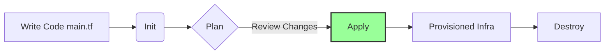

# Infrastructure as Code (IaC) with Terraform

**Date:** February 16, 2026
**Topic:** Infrastructure as Code (IaC)
**Project:** Automated Docker Provisioning
**Tools:** Terraform + Docker

## Project Overview
This project demonstrates the core principles of **Infrastructure as Code (IaC)**. Instead of manually configuring environments using GUI dashboards or imperative CLI commands (`docker run`), we define the desired state of our infrastructure in a declarative configuration file (`main.tf`).

Terraform uses this configuration to automatically provision, update, and destroy a local Docker container running an NGINX web server.

## Tech Stack
| Component | Technology | Description |
| :--- | :--- | :--- |
| **IaC Tool** | Terraform | Infrastructure provisioning engine |
| **Provider** | Docker (Kreuzwerker) | Plugin allowing Terraform to talk to Docker Daemon |
| **Resource** | NGINX | The web server application being deployed |
| **State Management** | Local (`terraform.tfstate`) | Tracks resource IDs and metadata |

## Architecture & Workflow
The Terraform workflow follows a strict lifecycle:



## Implementation Details
1. The Configuration (main.tf)
    - The infrastructure is defined in HCL (HashiCorp Configuration Language).

    - Provider Block: Connects to the local Docker socket (npipe:// for Windows).

    - Resource docker_image: Pulls nginx:latest.

    - Resource docker_container: Runs the image and maps port 8000 (Host) to 80 (Container).

2. Dependency Management
    - Terraform automatically handles the Dependency Graph.

    - It understands that the docker_container depends on the docker_image.

    - Therefore, it implicitly pulls the image before attempting to start the container.

##  How to Run Locally
**Initialize Terraform:**
    - Downloads necessary providers.

``` Bash
terraform init
Preview Changes:
Shows the execution plan without making changes.
```

``` Bash
terraform plan
Apply Infrastructure:
provisions the container. Confirm with yes.
```

``` Bash
terraform apply
Verify: Access http://localhost:8000 to see the NGINX welcome page.

Teardown:
Removes all resources defined in the code.
```

``` Bash
terraform destroy
```

## FAQ / Interview Prep
1. What is IaC?
Infrastructure as Code (IaC) is the practice of managing and provisioning infrastructure through machine-readable definition files, rather than physical hardware configuration or interactive configuration tools. <br> **It enables version control for infrastructure.**

2. How does Terraform work?
Terraform reads the code (main.tf) and compares it against the State File (terraform.tfstate) to calculate the "Delta" (what needs to change). <br> It then makes API calls to the Provider (Docker/AWS/Azure) to reach the desired state.

3. What is the Terraform State file?
The .tfstate file is the "Brain" of Terraform. <br> It maps real-world resources (like a Docker Container ID) to your configuration code. <br> It is the Source of Truth. **Note: Never delete this file manually.**

4. Difference between Apply and Plan?
    - Plan: A "Dry Run". It is a read-only operation that simulates changes to verify the logic.

    - Apply: The "Write" operation. It executes the API calls to create/modify/delete resources.

5. What are Terraform Providers?
Providers are plugins (like drivers) that allow Terraform to interact with specific APIs. <br> Examples include aws, google, azurerm, and docker.

6. What is Resource Dependency?
Resources often rely on each other (e.g., A subnet must exist before a server can be placed in it).<br> Terraform builds a dependency graph to create resources in the correct order. <br> We can also force dependencies using depends_on.

7. How do you handle secret variables?
    - Secrets (passwords, keys) should never be hardcoded in main.tf.

    - Use variable blocks marked as sensitive = true.

    - Pass them via Environment Variables (TF_VAR_password).

    - Use a .tfvars file (and add it to .gitignore).

    - Use external vaults (AWS Secrets Manager, HashiCorp Vault).

8. Explain the benefits of Terraform?
**Platform Agnostic:** Works with AWS, Azure, Google, and on-prem.

**Immutable Infrastructure:** Prevents "configuration drift."

**Version Control:** Infrastructure history is stored in Git.

**Declarative:** You say what you want, not how to get there.